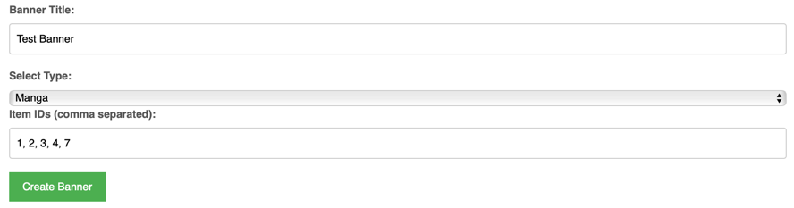
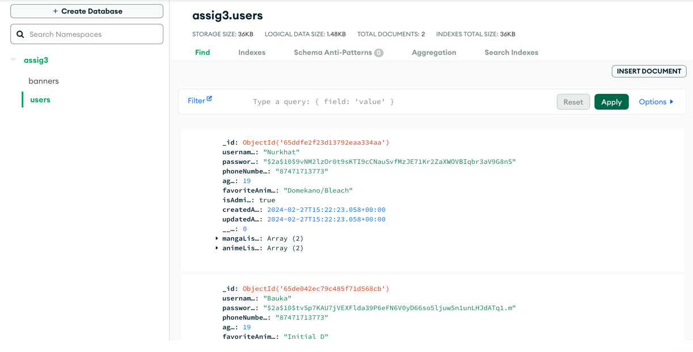

# Anime Catalog Project

## Introduction
Welcome to the Anime and Manga Catalog Project! This application is a comprehensive platform for anime enthusiasts offering a rich and interactive.


## Brief excursion
On My Web-site you can:
1. <b>Search for anime and manga in a unique search engine and read information about each work on a separate page.</b>
2. <b>Find out the latest anime from unique carousel banners on the main page. Each banner can store more than one image, title and description.</b>
3. <b>As an admin, add new banners such as anime or manga. This is relevant when creating collections of anime or manga, for example, top detective stories. To do this, you need to log in as an administrator, select the name of the banner, its type and enter the id of the anime and manga from the api, separated by commas. For example: `https://api.jikan.moe/v4/anime/1`. </b>
```
IMPORTANT!: the api website does not have information on all IDs; they may have been deleted.

List of the first available anime IDs from the api: 1, 5, 6, 7, 8
List of the first available manga IDs from the api: 1, 2, 3, 4, 7
```

4. <b>Going to the anime or manga page, add them to your list, which is located on the profile page. There the user can change the status of an element in the list or delete it.</b>
5. <b>Delete and edit existing banners. Important note! You cannot delete or edit the very first two banners; they are considered the main ones.</b>
6. <b>As an admin, add new users or delete, edit, or give admin rights to existing users.</b>

## Features

### Anime Catalog
- **Design:** The catalog features an engaging design using EJS and CSS. Banners for existing and new items are centered in containers of uniform width, separated by dividers, and maintaining a consistent style and color scheme.
- **Responsive Design:** The layout is fully responsive, ensuring a seamless experience across various devices.
- **Content:** Each anime banner can include more than one  images descriptions, and timestamps for creation, updates, and deletion.
- **Layout:** The homepage showcases these items in well-thought-out blocks, each with a carousel displaying the images and details like the name and description.
- **API Integration:** Two different APIs related to anime are integrated for dynamic content.

### Admin Features
- **Content Management:** Admins can add, edit, or delete anime items from the main page.
- **User-friendly Interface:** The admin page is designed for ease of use while managing content.
```
Login: Nurkhat
Password: 1234567
```

### Deploy
```
https://web2-ass4-nis-uralsk-the-best.onrender.com
```

### User Registration
- **Extended Information:** The registration process captures comprehensive user information.
- **Password Security:** User passwords are hashed using bcrypt before storage for enhanced security.

### Authentication
- **Password Verification:** Passwords are retrieved in hashed form and compared with the database hash.
- **Authorization Checks:** Routes requiring certain permissions have integrated authorization checks.
- **Admin Username:** The admin username is uniquely tied to the project creator’s name.


### Middleware for Authentication
- **Route Protection:** Middleware is implemented to protect routes that require authentication.
- **Session Token Verification:** The middleware checks for session tokens or other authentication mechanisms.
- **Redirection:** Unauthenticated users are redirected to the login page.


## Getting Started
- **Installation:** Download the project using the command `https://github.com/nktwn/web2_ass4.git` or download it from github.
- **Running the Application:** After opening the project, enter the `node app.js` command and go to localhost 3000.
